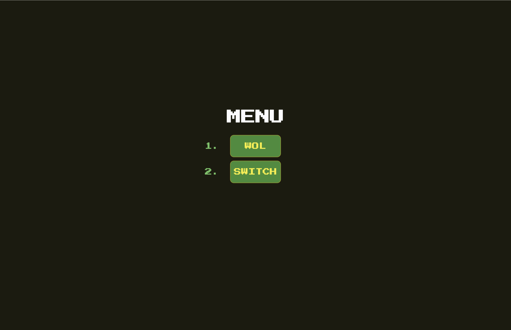
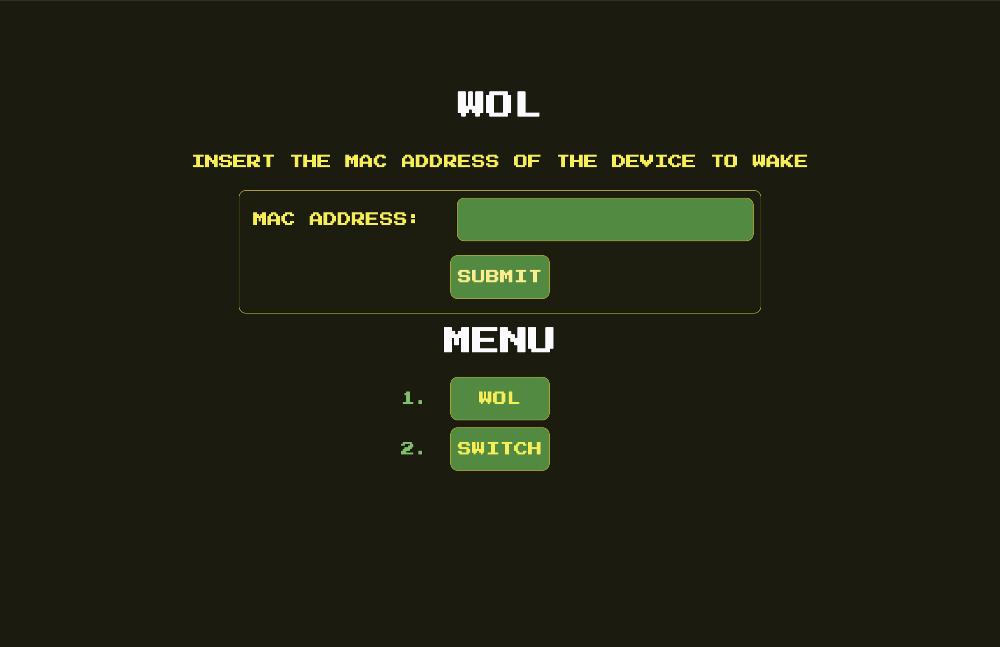
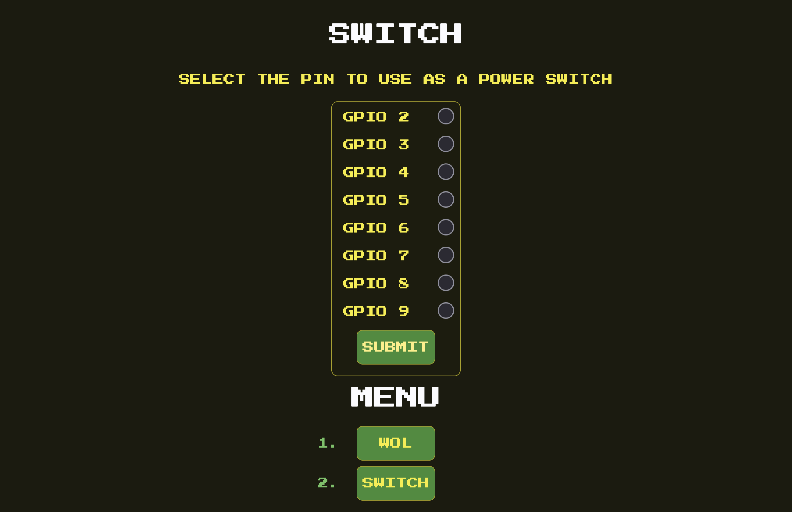

# wakesp



<!-- vim-markdown-toc GFM -->

- [Features](#features)
- [Requirements](#requirements)
- [Installation](#installation)
  - [Automatically Setting Environment Variables](#automatically-setting-environment-variables)
- [Access Web Interface](#access-web-interface)
- [Using with Other Chips](#using-with-other-chips)

<!-- vim-markdown-toc -->

Wakesp (from the words `wake` and `esp`) is a versatile firmware project for ESP32 microcontrollers, specifically crafted for the ESP32-C3 but adaptable to various ESP32 chips. Leveraging the power and safety of Rust, Wakesp provides functionalities such as dynamic DNS updates, a user-friendly web interface, and Wake-on-LAN capabilities. It operates entirely asynchronously without an OS, ensuring efficient performance with a minimal memory footprint of under 500kB.

## Features

- **Dynamic DNS Updates:** Update your DDNS provider with the latest IP address.
- **Web Interface:** A nice web interface which makes using wakesp easy.
- **Wake-on-LAN:** Send WOL packets to wake up devices on your network.
- **Async:** Completely async without an OS thanks to [embassy](https://github.com/embassy-rs/embassy).
- **Rust:** Benefit from the safety and performance of Rust.
- **Small Footprint:** Wakesp currently uses less than 500kB of flash memory.
- **ESP32 compatible:** Designed specifically for the ESP32 microcontrollers thanks to the [esp-hal](https://github.com/esp-rs/esp-hal).

|                          |                                |
| ------------------------ | ------------------------------ |
|  |  |

## Requirements

`espflash` to flash your board

```bash
cargo install espflash
```

This repository

```bash
git clone https://github.com/etiennecollin/wakesp
```

## Installation

> **If you are using a chip that is not the ESP32-C3, see [Using with Other Chips](#using-with-other-chips).**

Set the following environment variables. These variables are used to configure the ESP32 at compile time. Modify the values to match your needs:

**WiFi Configuration**

- `HOSTNAME`: The hostname for your ESP32 device on the network.
- `SSID`: The SSID (name) of the WiFi network your ESP32 will connect to.
- `PASSWORD`: The password for the WiFi network.

**DNS Update Configuration**

- `DNS_ENABLE`: A flag to enable or disable DNS updates. Set to "true" or "1" to enable.
- `DNS_CHECK_DELAY`: The interval in seconds between the DNS update checks.
- `DNS_HOST`: The hostname of the update service of your DNS provider.
- `DNS_HTTP_REQUEST`: The HTTP request format for updating the DNS. Customize with your host, domain, and password details.

**HTTP Server Configuration**

- `HTTP_SERVER_ENABLE`: A flag to enable or disable the HTTP server (the web interface). Set to "true" or "1" to enable.
- `HTTP_LISTEN_PORT`: The port on which the ESP32 will listen for HTTP requests.

**WOL Configuration**

- `WOL_ENABLE`: A flag to enable or disable the WOL feature of the HTTP server. Set to "true" or "1" to enable.
- `WOL_BROADCAST_ADDR`: The broadcast address to send Wake-on-LAN packets to. Typically set to "255.255.255.255" to broadcast to all devices on the local network.

:warning: **Switch Configuration** :warning:

- `SWITCH_ENABLE`: A flag to enable or disable the Switch feature of the HTTP server. This uses the ESP32 as a power switch. Set to "true" or "1" to enable.
  - :warning: Check the datasheet of your ESP32 to **assign the right pins as GPIO** in the `./src/main.rs` file.
  - :warning: Make sure to properly **configure the GPIO pins as Pull Up or Pull Down** in the `./src/main.rs` file depending on which device you want to switch ON and OFF.
    - Computer power switches **often** need a Pull Up configuration.
  - :warning: Make sure the pins on which you connect the Wakesp GPIO pins have a **maximum voltage of 3.3V**. Use a level shifter if needed.
  - :warning: Make sure the Wakesp and the devices it is connected to **share the same ground**.
  - :warning: **If you do not follow these last 3 points, the Wakesp and/or the devices it is connected to could be permanently damaged.**

Here is an example of setting these variables:

```bash
# For WIFI
export HOSTNAME="myesp32"
export SSID="MyWiFiNetwork"
export PASSWORD="mywifipassword"

# For DNS update
export DNS_ENABLE="true"
export DNS_CHECK_DELAY="60"
export DNS_HOST="dynamicdns.park-your-domain.com"
export DNS_HTTP_REQUEST="GET /update?host=<HOST>&domain=<DOMAIN>&password=<PASSWORD>&ip= HTTP/1.1\r\nHost: dynamicdns.park-your-domain.com\r\nConnection: close\r\n\r\n"

# For HTTP server
export HTTP_SERVER_ENABLE="true"
export HTTP_LISTEN_PORT="80"

# For WOL
export WOL_ENABLE="true"
export WOL_BROADCAST_ADDR="255.255.255.255"

# For Switch
export SWITCH_ENABLE="true"
```

Now, make sure that your current working directory (output of `pwd` command) is the root of the cloned repository.
With the ESP32 plugged into your computer, you can then flash it with:

```bash
cargo run --release
```

> Run this last command in the same shell session you set the environment variables in.

Follow the on-screen instructions. Note the IP address given to the ESP32 by the router. It should be printed in the opened terminal as a log. You will be able to connect to the web interace with it.

Once the board is flashed, you may close your terminal and unplug your ESP32. Power it via USB anywhere that is reached by the chosen WIFI network. The board will start working immediately once powered by USB.

### Automatically Setting Environment Variables

If you plan on flashing your board more than once, you could edit the file `./.cargo/config.toml` such that it sets the variables automatically. To do so, modify the `[env]` section of the file as follows to add your environment variables:

```toml
# ...
[env]
# ...

# For WIFI
HOSTNAME="myesp32"
SSID="MyWiFiNetwork"
PASSWORD="mywifipassword"

# For DNS update
DNS_ENABLE="true"
DNS_CHECK_DELAY="60"
DNS_HOST="dynamicdns.park-your-domain.com"
DNS_HTTP_REQUEST="GET /update?host=<HOST>&domain=<DOMAIN>&password=<PASSWORD>&ip= HTTP/1.1\r\nHost: dynamicdns.park-your-domain.com\r\nConnection: close\r\n\r\n"

# For HTTP server
HTTP_SERVER_ENABLE="true"
HTTP_LISTEN_PORT="80"

# For WOL
WOL_ENABLE="true"
WOL_BROADCAST_ADDR="255.255.255.255"

# For Switch
SWITCH_ENABLE="true"

# ...
```

## Access Web Interface

Connect to your device by typing `http://<IP_OF_YOUR_ESP32>:<HTTP_LISTEN_PORT>` in your favourite browser. For example:

- `http://192.168.2.10:80`

## Using with Other Chips

Wakesp was built for the ESP32-C3 chip but should be compatible with most other ESP32 chips. To use another chip, make sure it has enough memory (Wakesp currently uses a bit less than 500 kB of flash memory).

Here are the rust targets for a few chips that should be compatible:

- `riscv32imc-unknown-none-elf` for ESP32-C2 and ESP32-C3
- `riscv32imac-unknown-none-elf` for ESP32-C6 and ESP32-H2
- `xtensa-esp32s3-none-elf` for ESP32-S3
- `xtensa-esp32-none-elf` for ESP32

In the `Cargo.toml` file, modify appropriately:

```toml
# ...
[build]
target = "riscv32imc-unknown-none-elf" # <- Set the right target
rustflags = [
    # ...

    # Uncomment for esp32c6 and esp32h2
    # "-C", "link-arg=-Trom_coexist.x",
    # "-C", "link-arg=-Trom_phy.x",
]
# ...
```

Then, in the same file, set the appropriate features for the dependencies. These are the lines to modify:

```toml
# ...
[features]
default = [
    "esp32c3", # <- This line
    "log",
]

# And the following line
esp32c3 = ["esp-hal/esp32c3", "esp-println/esp32c3", "esp-backtrace/esp32c3", "esp-wifi/esp32c3", "esp-hal-embassy/esp32c3"]
# ...
```

The feature names are specified in each package documentation. You _should_ be able to simply replace occurrences of `esp32c3` with the name of your chip.
